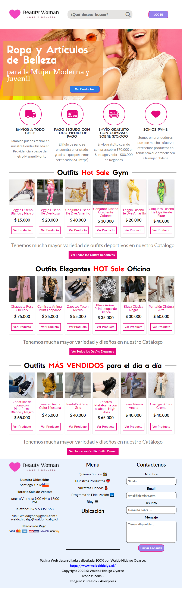
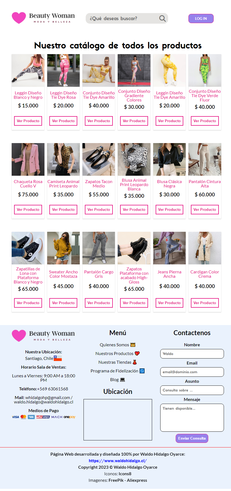
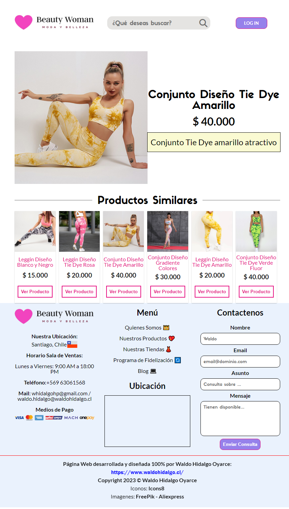
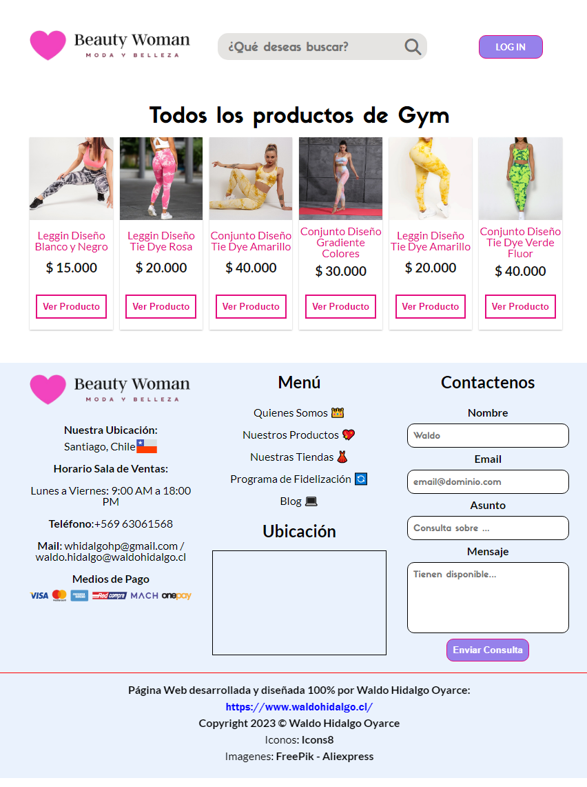
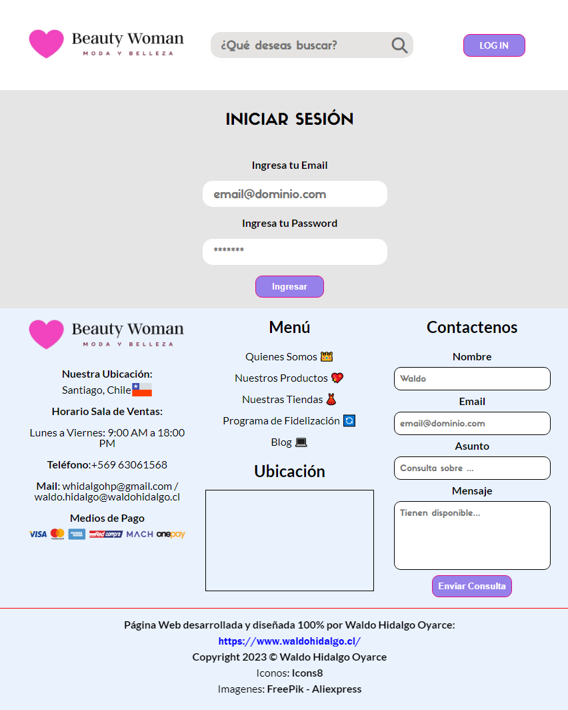
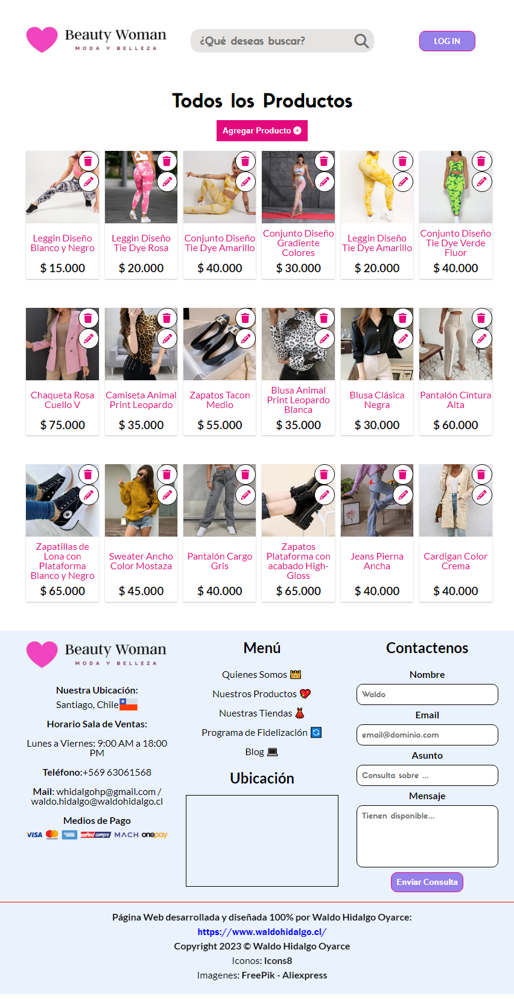
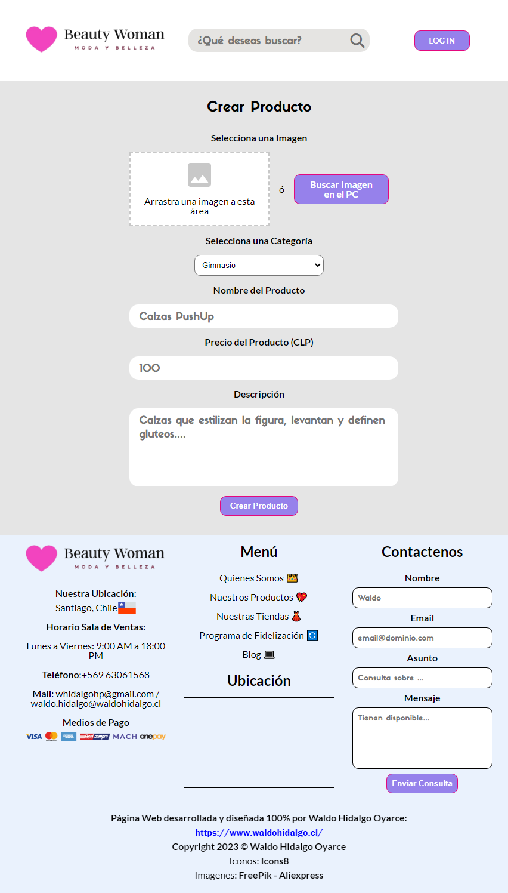
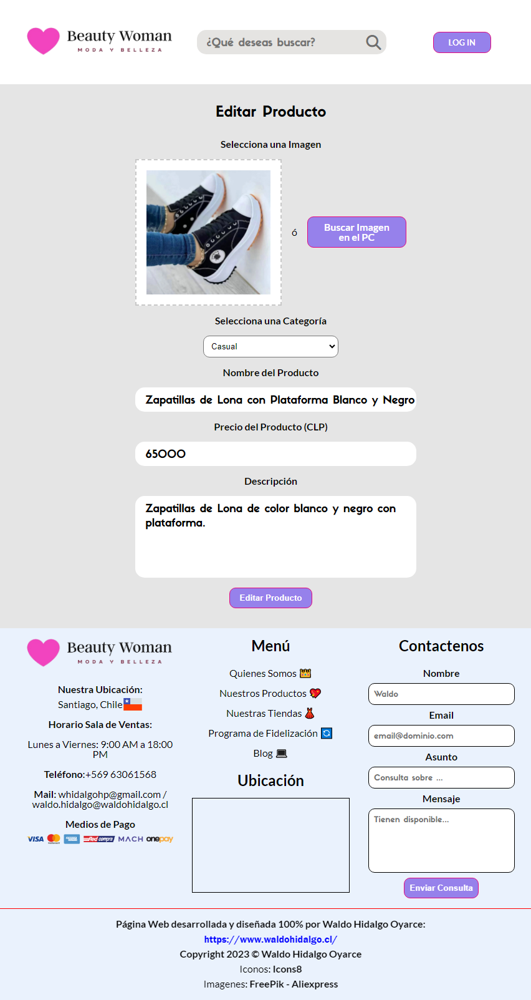
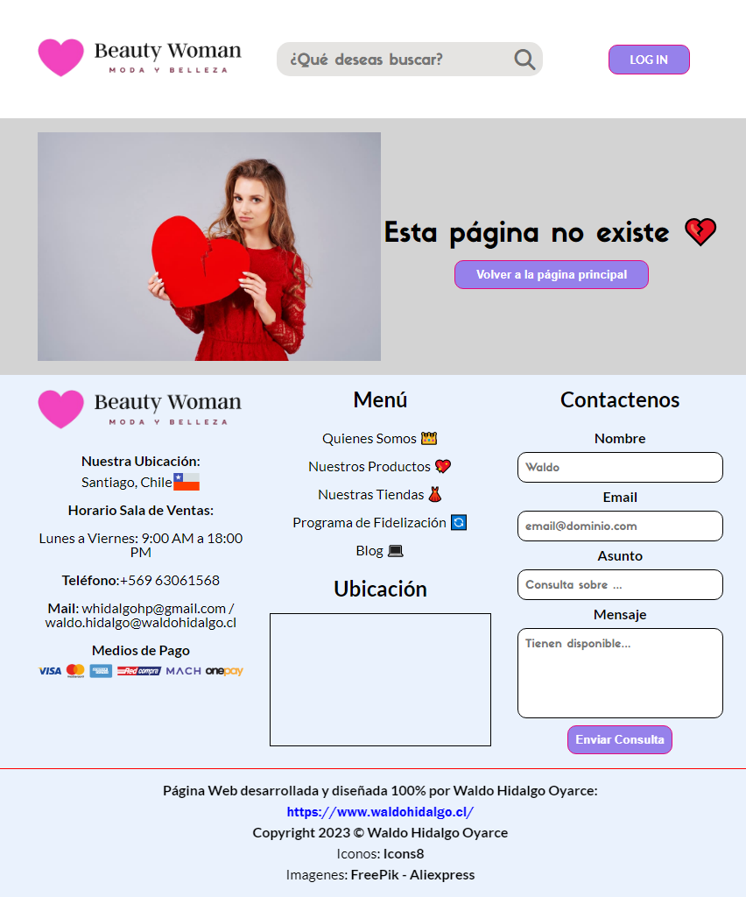

## Resolución del Challenge 3 del programa Oracle Next Education denominado Alura Geek

He dado resolución completa al Challenge 3 del programa ONE el cual consiste en la creación de una tienda virtual la cual muestra información sobre los productos a la venta mediante conexiones asíncronas vía JavaScript con una fake API creada usando **JSON SERVER**. Me tome la libertad de personalizar la tienda a crear, cambiándole el concepto de negocio hacia una **Tienda de Venta de Productos para mujeres jóvenes**. 

En la planificación del Challenge 3 se señala que el desafío se compone de **2 sprints**. El primer Sprint (sprint es un concepto de SCRUM el cual se refiere a avances en la entrega de un producto de software) corresponde a la creación del FRONT END de la tienda. El diseño que se entrega para realizar el sprint 1 se encuentra creado en FIGMA y dicho diseño se puede visualizar en el siguiente link: [Diseño en Figma](https://www.figma.com/file/VKPpKzjmleyt9rcLUTtolg/AluraGeek-(Copy)?type=design&node-id=0-1&mode=design). Como se puede visualizar en mi proyecto, cumplo con incluir con lo que piden pero mi diseño es mucho más atractivo visualmente. Los requisitos del sprint 1 se encuentran descritos en la herramienta **Trello** y el link para acceder a tales requisitos es el siguiente: [Requisitos Primer Sprint](https://trello.com/b/NdAAOWky/sprint-2). Como se puede apreciar en la columna **Backlog** en el Trello, allí se encuentran todos los requisitos. Mi proyecto cumple con **TODOS**:

-Título de su sitio web 
-Logo de la empresa 
-Menú principal 
-Buscador de artículos 
-Botón de inicio de sesión 
-Banner 
-Galería de productos 
-Formulario de contacto 
-Rodapié aka Footer 

Una vez cumplido con desarrollar el primer sprint, se comienza con el segundo Sprint el cual consiste en usar JavaScript para manipular el DOM, agregar contenido dinámicamente, realizar operaciones CRUD con la fake API desarrollada que se creo en JSON SERVER y agregar funcionalidades. Los requisitos del sprint 2 se encuentran en la herramienta Trello y el link para visualizarlos se encuentra en el siguiente link a Trello: [Requisitos Segundo Sprint](https://trello.com/b/e0UaUgh6/sprint-3). Como se puede comprobar en mi proyecto también he cumplido con **TODOS** los requisitos:

-Funcionalidad Botón Banner para visualizar todos los productos  
-Validación de Formulario de Contacto el cual se encuentra en el Footer cumpliendo con: 
&nbsp;&nbsp;&nbsp;&nbsp;-Campo de nombre: máximo 40 caracteres. 
&nbsp;&nbsp;&nbsp;&nbsp;-Campo de mensaje: máximo 120 caracteres. 
&nbsp;&nbsp;&nbsp;&nbsp;-Validación para que los campos no queden vacíos o en blanco. 
&nbsp;&nbsp;&nbsp;&nbsp;-Debe mostrar al usuario los mensajes de error en caso de que no se cumplan las validaciones. 
&nbsp;&nbsp;&nbsp;&nbsp;-Botón Enviar mensaje: envía el mensaje si el formulario está correctamente completado.  
-Validación de Formulario de Iniciar Sesión cumpliendo con: 
&nbsp;&nbsp;&nbsp;&nbsp;-Campo de correo electrónico: no debe estar en blanco ni vacío. 
&nbsp;&nbsp;&nbsp;&nbsp;-Debe estar en formato de correo electrónico que contenga el carácter especial @ seguido de un dominio o proveedor seguido de un punto (.) 
&nbsp;&nbsp;&nbsp;&nbsp;-Campo de contraseña: no debe estar en blanco ni vacío. 
&nbsp;&nbsp;&nbsp;&nbsp;-Botón de inicio de sesión: si el usuario está autenticado y debe redirigir al menú de administrador, de lo contrario debe mostrar un mensaje de error.  
-Validación de Formulario en la página de Agregar Nuevo Producto cumpliendo con: 
&nbsp;&nbsp;&nbsp;&nbsp;-Agregar campo de imagen y Botón para buscar imagen en el PC el cual debe permitir al usuario cargar una imagen. 
&nbsp;&nbsp;&nbsp;&nbsp;-Campo para nombre de producto: debe tener un máximo de 20 caracteres. 
&nbsp;&nbsp;&nbsp;&nbsp;-Campo para precio del producto: el usuario solo puede ingresar números. 
&nbsp;&nbsp;&nbsp;&nbsp;-Campo para descripción del producto: debe tener un máximo de 150 caracteres. 
&nbsp;&nbsp;&nbsp;&nbsp;-Botón Añadir producto: si el formulario está completado correctamente se añadirá el producto, en caso contrario debería mostrar un mensaje de error.
Recordando que ninguno de los campos debe estar en blanco o vacío.  
-La barra de búsqueda de productos de la tienda debe filtrar los productos por el nombre del producto  
-Al hacer clic en el botón Ver Productos, el usuario debería poder ver todos los productos ofrecidos por la tienda.  
-En la página de Administrador debe existir un botón para **agregar** un nuevo producto y hacer vía JavaScript que se pueda agregar un nuevo producto en el JSON SERVER.  
-En la página de Administrador debe existir un botón para **eliminar** productos y hacer, vía JavaScript, que se pueda eliminar un producto en el JSON SERVER.  
-En la página de Administrador debe existir un botón para **editar** productos y hacer, vía JavaScript, que se pueda editar un producto en el JSON SERVER.  
-**DESAFIO EXTRA (opcional)**: Crear una página de descripción de productos de modo tal que al hacer click en el botón de Ver Productos que se encuentra en la página principal para cada producto sea posible acceder a la data de descripción de solo ese producto y además mostrar una sección con productos recomendados dentro de esa categoría.

Como se puedo apreciar, al interactuar con mi proyecto, he creado TODO lo que piden como requisito y además he ido más allá en cuanto a temas de diseño. Como un resumen de extras que contiene mi proyecto listo lo siguientre:

-Crear páginas de error (simil a un error 404) cuando se intenta a acceder a páginas como pagina_producto.html sin ID ó con más de 2 parámetros ó con ID que no se encuentra en el JSON; acceder a página productosAdmin.html sin los parámetros query en la URL (esto, en la realidad, no se realiza ya que pasar parámetros en la URL del tipo contraseña no es seguro pero como ejercicio para trabajar con query parameters me permito realizar aquello) de email y password de Admin ó con más de 2 parámetros ó con parametros que no tienen ni los nombres email o password. 

-Agregar Drag Área en las páginas de creación y edición de producto junto con un botón de selección de archivos en el PC y la validación del tipo de archivo vía MIME Types.

-Agregar validación al campo de Imagen cuando se intenta enviar el formulario sin haber seleccionado previamente un archivo de imagen. 

-Mostrar en la pantalla de Inicio solo 6 productos por categoría.

-Despligue de JSON SERVER a internet usando el servicio Cyclic.sh vía repositorio en GitHub. Como Json Server está desplegado desde un repositorio los cambios hechos vía métodos HTTP se revierten luego de unos minutos por lo que, por ejemplo, eliminar todos los productos o editar los productos o agregar 1 ó más productos resultará que los cambios se podrán visualizar pero al cabo de un tiempo el JSON SERVER se reinicia con la misma data almacenada en el archivo db.json alojada en mi repositorio en GitHub. El JSON SERVER desplegado en cyclic.sh se puede visualizar aquí: [JSON SERVER desplegado en Cyclic.sh](https://tiny-costume-tuna.cyclic.app/).

<strong>Para finalizar y a modo de conclusión: este desafío es mucho más complejo que los 2 desafíos anteriores ya que requiere una alta comprensión de conceptos avanzados de JavaScript, específicamente, el trabajo con arrays, métodos, objetos, módulos, funciones asíncronas y promesas. Sin embargo, toda persona que presente dificultades en comprender estos conceptos o desee algún tipo de guía bien puede clonar este repositorio y/o el repositorio donde se encuentra el db.json y hacer sus propias pruebas e implementaciones.</strong>

A continuación se puede visualizar imagenes de algunas de las páginas del sitio web:

**Página Principal:**  
 

**Catálogo de Productos:**  
 

**Página de Producto:**  
 

**Página de Categoría:**  
 

**Página de Ingreso:**  
 

**Página de Panel de Administración:**  
 

**Página de Crear Producto:**  
 

**Página de Editar Producto:**  
 

**Página Tipo Sección 404:**  
 

    

